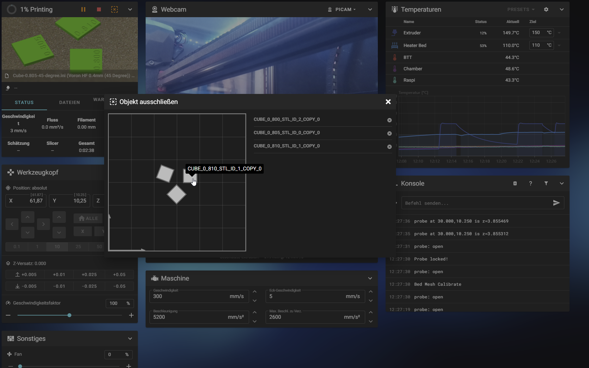

# Cancel Objects installieren  
  
 Dieser Guide zeigt euch, wie ihr mit Klipper und Susi Objekte, die gerade gedruckt werden,
  abbrechen könnt.
  
---
**<u>In Printer.cfg einfügen</u>**  

`[exclude_object]`
  
---
**<u>Benötigetes Programm laden und installieren</u>**
  
<u>Exe installieren</u>
- download https://github.com/kageurufu/preprocess_cancellation/releases/latest (für euer Betriebssystem)
- in Superslicer Ordner verschieben. Dort wo die Superslicer.exe liegt  
   
>*Die Exe könnt ihr gerne von einem Virenprogramm prüfen lassen. Windows kann sich melden, da diese nicht lizensiert ist.*
   
  
---
  
**<u>In Superslicer einbinden</u>**  
   
Folgende Zeile in "Druckeinstellungen/Ausgabeoptionen/Nachbearbeitungs Script" einfügen:  
  
`preprocess_cancellation.exe;`
  
---
**<u>Was macht die Exe?!</u>**   
  
Wenn ihr jetzt ein Object gesilced habt und es zum Drucker hochladet, wird das Programm gestartet.
Es teilt die Objekte im Gcode auf und fügt eine Art "Trennungskommando" ein. So ist es möglich ein Objekt durch eine Art "Sprungbefehl" abzubrechen.
Der Button zum Abbrechen findet ihr neben dem rotem "Stop-Button". Es ist ein Kreuz mit einer gestrichelten Umrandung. Wenn ihr den Button drückt dann geht ein neues Fenster auf und ihr könnt das fehlerhafte Objekt auswählen.
    
 
  
>Viel Spaß damit.  
>*Da die Exe nicht von uns stammt, geben wir auf diese keine Sicherheit. Daher bitte immer prüfen*
   
   

