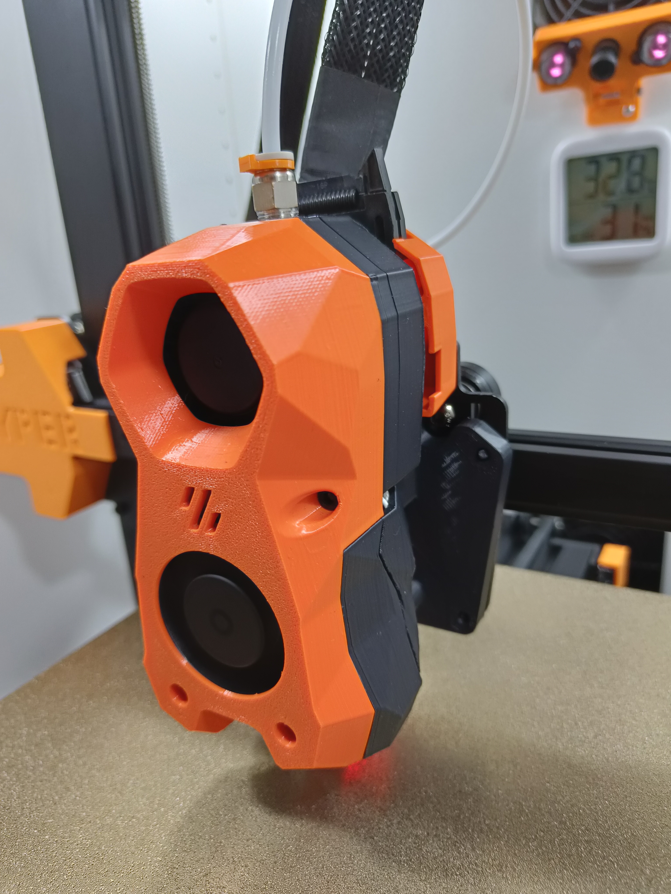
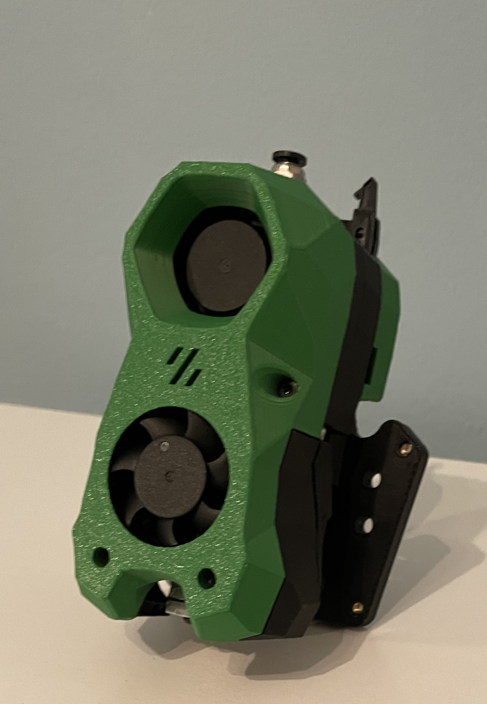

# Druckbeispiel - Stealthburner Mod

### <u>Extrudr - Anthrazit (ASA)</u> 
 

  

### <u>Das Filament - Orange (PLA)</u> 
 

  

  
  
### <u>Extrudr-Smaragdgrün (ASA)</u> 
  

  

 
  
### <u>Esun-Fire-Red (ABS)</u> 
  

  

 
  
  ### <u>Esun-Hellblau (ABS)</u> 
  

  

 
  
### <u>Smartfill-Schwarz (ASA)</u> 
  

  

 
  

Bei Fragen gerne auf dem Discord vorbeischauen.  
https://discord.gg/Nf7FXuk8
